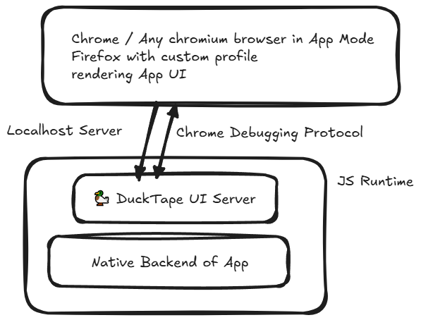

# 🦆 Ducktape
A tiny helper to create a desktop application out of a web app, This is just an experiment and works the same way [gluon](https://github.com/gluon-framework/gluon) does, though it's abandonded now 😢

> [!WARNING]
> It's very incomplete so if you want something a bit more feature complete, Consider tauri, gluon or electron for this purpose

## ARCH

## TODO
It's still incomplete so complete it and do something with it, What I don't know lol, Also look into making it compatible with [welsonJS](https://github.com/gnh1201/welsonjs), To remove dependency on NodeJS so it can make use of more pre-installed windows components, Maybe let it automatically use a webview if it's installed (If it offers an actually wantable features)